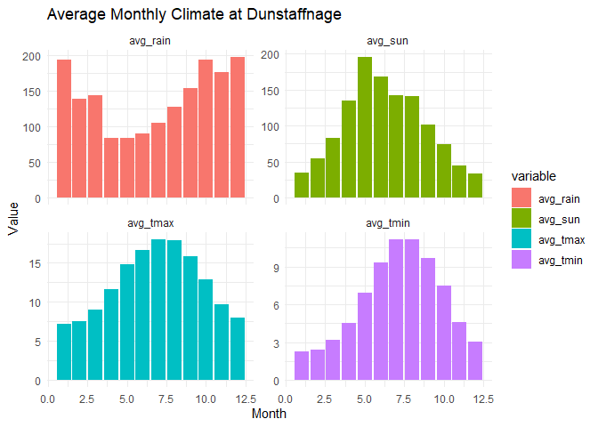
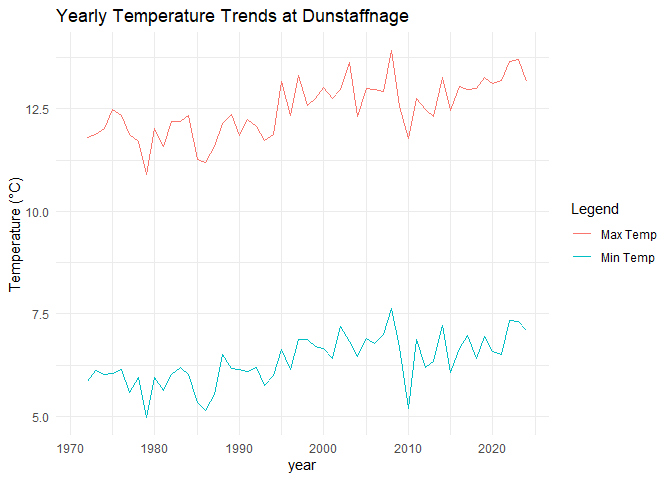
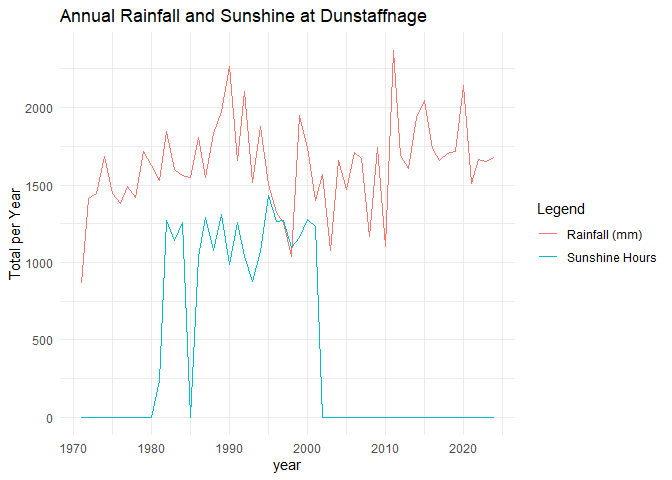
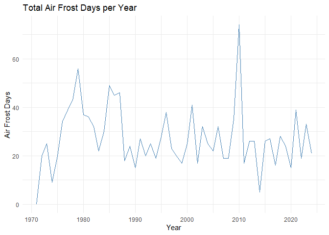

Balkcom
================

``` r
#install.packages("tidytuesdayR")
#install.packages("devtools")
library(tidytuesdayR)
```

    ## Warning: package 'tidytuesdayR' was built under R version 4.5.2

``` r
library(rnaturalearth)
```

    ## Warning: package 'rnaturalearth' was built under R version 4.5.2

``` r
library(sf)
```

    ## Linking to GEOS 3.13.1, GDAL 3.11.0, PROJ 9.6.0; sf_use_s2() is TRUE

``` r
library(tidyverse)
```

    ## ── Attaching core tidyverse packages ──────────────────────── tidyverse 2.0.0 ──
    ## ✔ dplyr     1.1.4     ✔ readr     2.1.5
    ## ✔ forcats   1.0.0     ✔ stringr   1.5.1
    ## ✔ ggplot2   3.5.2     ✔ tibble    3.3.0
    ## ✔ lubridate 1.9.4     ✔ tidyr     1.3.1
    ## ✔ purrr     1.1.0

    ## ── Conflicts ────────────────────────────────────────── tidyverse_conflicts() ──
    ## ✖ dplyr::filter() masks stats::filter()
    ## ✖ dplyr::lag()    masks stats::lag()
    ## ℹ Use the conflicted package (<http://conflicted.r-lib.org/>) to force all conflicts to become errors

``` r
library(dplyr)
library(tmap)
library(rnaturalearth)
library(knitr)
```

    ## ---- Compiling #TidyTuesday Information for 2025-08-19 ----
    ## --- There is 1 file available ---
    ## 
    ## 
    ## ── Downloading files ───────────────────────────────────────────────────────────
    ## 
    ##   1 of 1: "scottish_munros.csv"

# Question \#4: Which are the rainiest/coldest/sunniest/hottest months to visit the highest peak? Has that changed over time

    ## ---- Compiling #TidyTuesday Information for 2025-10-21 ----
    ## --- There are 2 files available ---
    ## 
    ## 
    ## ── Downloading files ───────────────────────────────────────────────────────────
    ## 
    ##   1 of 2: "historic_station_met.csv"
    ##   2 of 2: "station_meta.csv"

<!-- -->

# Question \#5: Were there any historic years that were particularl rainy/cold/sunny/hot on the peak

    ## Warning: Removed 1 row containing missing values or values outside the scale range
    ## (`geom_line()`).
    ## Removed 1 row containing missing values or values outside the scale range
    ## (`geom_line()`).

<!-- --><!-- --><!-- -->
